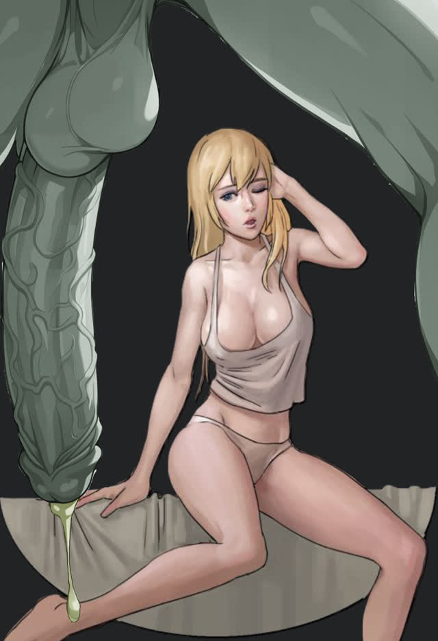

# titties

Sway dotfiles. Dark, moody, and functional. Best suited for Void Linux — the color palette is inspired by Void's branding.

## What's in here

```
.config/
├── sway/           # Window manager
├── foot/           # Terminal (Agave, size 25)
├── fuzzel/         # App launcher
├── mako/           # Notifications
├── mpv/            # Media player
├── tmux/           # Multiplexer
├── zathura/        # PDF viewer
├── swayidle/       # Idle manager
├── swaylock/       # Lock screen
├── swaynag/        # Dialogs
├── i3status-rust/  # Status bar
└── fontconfig/     # Font rendering

.bashrc             # Shell config
.vimrc              # Editor config
colors.json         # Palette (for reference)
palette.html        # Interactive palette preview
```

## Install

Using [GNU Stow](https://www.gnu.org/software/stow/):

```bash
cd titties
stow .
```

## Colors

The palette is derived from the sway theme and used across all configs.

| Name | Hex |
|------|-----|
| Dark Abyss | `#0e1311` |
| Void Slate | `#161d1a` |
| Abyss Green | `#295340` |
| Accent Green | `#478061` |
| Mint Tint | `#7aa48d` |
| Starlight | `#cccccc` |
| Eclipse Blue | `#395b70` |
| Pulsar Purple | `#5a4575` |
| Nova Red | `#7a3d44` |
| Solar Amber | `#755935` |
